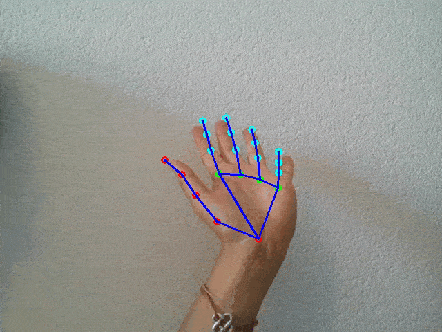
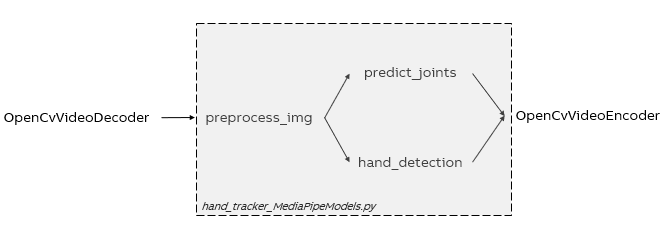

# Vision HandLandmark

In this document, the files of HandLandmark, of the category `Vision`, are described.

## Hand detection & Landmarks - Class generation

The file `hand_tracker_MediaPipeModels.py`, detects both the hand box and the hand landmarks by using models from MediaPipe (see MediaPipe [here](https://google.github.io/mediapipe) ).
Also, this file calls the code `non_maximum_suppression.py`

`hand_tracker_MediaPipeModels.py` creates a class called HandTracker, which is able to detect ONE hand.

The models can be found [in this folder](/resources/vision/hand_tracking/models). We use the following models:
- hand_landmark_3d.tflite OR hand_landmark.tflite
- palm_detection_without_custom_op.tflite
- anchors.csv

This code works both with the 3D model and the 2D model, the changes applied can be seen in the functions:
- `predict_joints`
- `call` (specifically in the last part of projecting keypoints)
                    
## Hand detection & Landmarks - Video detection

Running the file `run_video_HandTracking.py`, one will be able to detect the hand and its landmarks in a video environment. As seen in the following picture:

The distance of the landmarks to the camera can be seen by the color of the dots: red / green / blue, from closer to more far away from the camera.

One can also use this code with the model in 2D. If this is desired, then you only have to change line 7 of the code, where it's specified the path to the landmark model, you should change it to hand_landmark.tflite, then the code will make the necessary changes in the respective calculations.

For each frame of the video, this file calls the code `hand_tracker_MediaPipeModels.py` (see section Hand detection & Landmarks - Class generation), which detects the hand in the specific frame of the video and returns two matrixes: one for the hand landmarks (21x3 using the 3D model or 21x2 using the 2D model) and the other one for the box of the detection of the hand (4x2).

The big picture of the code flow is shown in the following picture, where in the middle part there are the most important functions of the file `hand_tracker_MediaPipeModels.py`:

## Requirements

You need to install the following libraries to run the code:
- Numpy: $ pip install numpy
- OpenCV: $ pip install opencv-python
- Tensorflow: $ pip install tensorflow